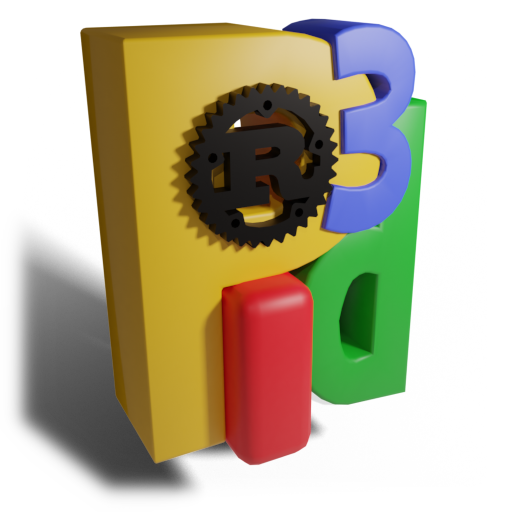

# rust_pi3d
translation of pi3d from python to rust



Following parts of the tutorial:
http://nercury.github.io/rust/opengl/tutorial/2018/02/08/opengl-in-rust-from-scratch-01-window.html
I have started the process of making a rust version of the python pi3d
module.

As at commit 12c692f most of the functionality is in place to get demos such
as ForestWalk working.

*Installation*

For this to work you need to install rust. Basically follow the instructions
here https://www.rust-lang.org/en-US/install.html It seems to be reasonably
fool proof though I've not tried it on Windows yet.

You also need to have SDL2 running. On linux it's pretty easy using

```sh
patrick@thiscomputer:~/rust/rust_pi3d$ sudo apt-get install libsdl2-dev
```

See the tutorial link at the top or the rust sdl2 crate site for what to
do for windows. PS I have added the SDL2.dll v2.0.10 x86 but you should
download and install the one appropriate for your windows and machine.

Then in the terminal navigate to wherever you cloned or extracted this
repo and build the executables using cargo, and run them like this (NB
now cd to the pi3d directory):

```sh
patrick@thiscomputer:~/rust/rust_pi3d/pi3d$ cargo build --examples --release
```
then
```
patrick@thiscomputer:~/rust/rust_pi3d/pi3d$ target/release/examples/game
patrick@thiscomputer:~/rust/rust_pi3d/pi3d$ target/release/examples/forest_walk
```
you only have to do the initial build once as this runs the build.rs script
that copies over the examples dependencies. After that you can run examples using.
```
patrick@thiscomputer:~/rust/rust_pi3d/pi3d$ cargo run --example game --release
```
and all the source will be checked and recompiled as required.

Building for release will take longer (maybe) and exclude debugging symbols etc but
run faster (obviously) and will be much smaller. If you want to build for
debug (probably sensible) exclude the `--release`. However if you do this
the required support files in `target/release/textures`, `models`, `ecubes`
and `fonts` will have to be copied into the `target/debug/` directory.

On the Raspberry Pi the OpenGL used by default SDL2 won't work unless you use
raspi-config and switch the graphics driver to the new experimental one.
It should be possible to compile SDL2 to use the built in Broadcom drivers
but I've not tried that. (Let me know if you do and what the problems are).

TODO::

~~installation, requirements and compile instructions on here!~~

~~build script to copy support files (images, models, fonts etc) to target
directory~~

~~Fonts and lettering.~~

error and failure handling. Many functions need to return a Result<..>
wrapper around whatever they are supposed to do.

~~Texture blender option (lower alpha to drop pixel)~~

Find out why last value of array_buffer is always set to zero (i.e.
why a sacrificial extra one needs to be added)

Mouse buttons

Offscreen textures, screen capture and post processing

Lifetimes and controlled deletion of Shaders and Programs.

More elaborate Camera functions.

Other Texture types i.e. different internal storage modes supported
by OpenGL

**As at 16 Dec 19 there are some trials making a python wrapper**

*see pyo3_module directory*